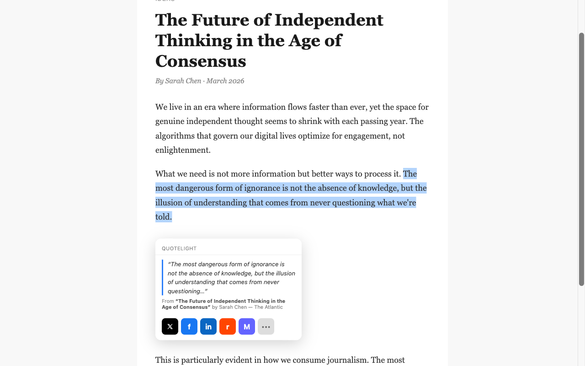

# QuoteLight

A Chrome extension that lets you highlight any quote on a webpage and share it to social media with automatic source attribution.



## How It Works

1. Highlight text on any webpage
2. A popup appears below your selection with sharing buttons
3. Click a platform to share the quote with full attribution (title, author, publication, URL)

## Supported Platforms

X, Facebook, LinkedIn, Reddit, Bluesky, Mastodon, WhatsApp, Telegram, Email

Character limits are handled automatically — quotes are truncated to fit each platform's constraints.

## Install

**From source:**

```bash
node build.js
```

Then in Chrome:

1. Go to `chrome://extensions/`
2. Enable **Developer mode**
3. Click **Load unpacked** and select this directory

No npm dependencies required — just Node.js for the build step.

## Project Structure

```
content/
  content.js      # Selection detection and popup rendering (Shadow DOM)
  metadata.js     # Page metadata extraction (Open Graph, JSON-LD, Twitter Cards)
  content.css     # Popup styles (injected into Shadow DOM)
platforms/
  platforms.js    # Share URL builders and character limits per platform
dist/
  quotelight.js   # Built bundle (generated by build.js)
tests/            # Unit tests (Node.js built-in test runner)
```

## Run Tests

```bash
node tests/content.test.js
node tests/metadata.test.js
node tests/platforms.test.js
```

## Privacy

- Runs entirely in the browser — no external servers
- No analytics or tracking
- Only stored data: Mastodon instance URL (optional, user-provided)
- Permissions: `activeTab`, `storage`
